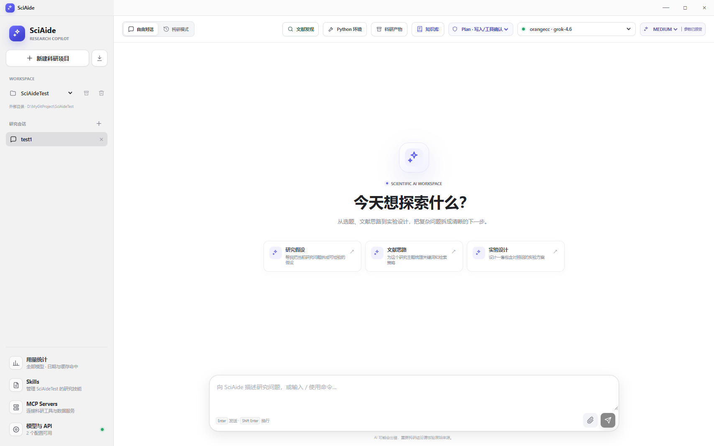
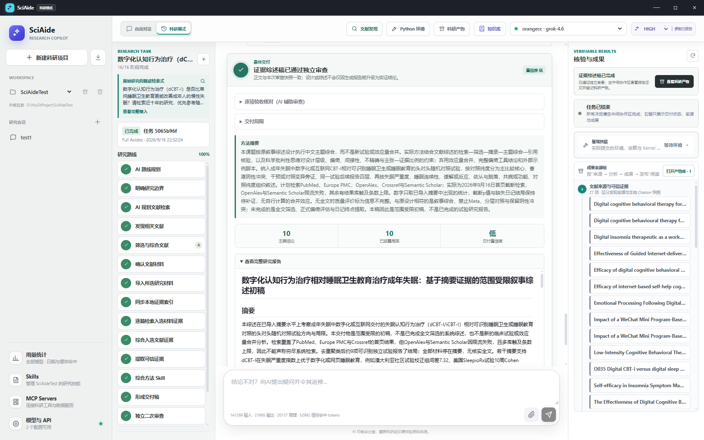
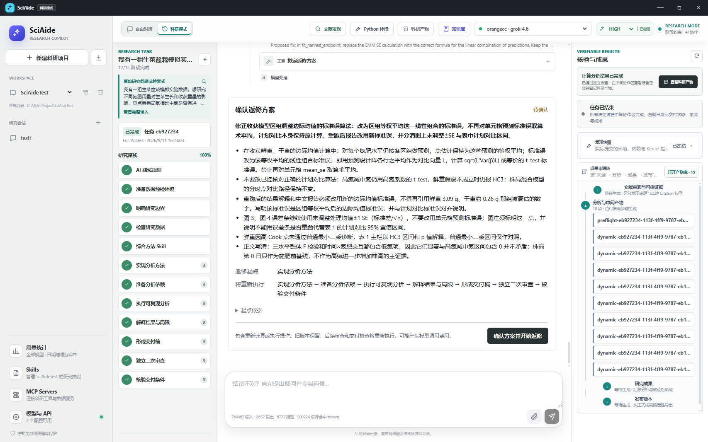

# SciAide

面向科研工作者的本地优先桌面 AI 助手。从研究问题出发，辅助完成文献检索、证据整理、数据分析、报告审查与返修，让结论能回到证据、结果能回到代码。

**当前版本：v1.0.2 · Windows x64**

[下载程序](https://github.com/wangh00/SciAide/releases/tag/v1.0.2) · [更新记录](CHANGELOG.md) · [开发状态](docs/CURRENT_STATE.md) · [开发指南](docs/development.md)

## 自由对话与项目工作区

围绕项目整理会话、附件、知识库与科研产物，可以直接讨论研究问题，也可以切换到科研模式推进完整任务。

- 自定义模型与 API，支持 OpenAI 兼容 Chat Completions、Responses 和 Anthropic Messages 协议；按模型设置上下文窗口与思考参数。
- 支持 PDF、DOCX、XLSX、CSV/TSV、TXT、Markdown 附件，以及 JPEG、PNG、WebP 图片输入；识图能力由用户配置的模型提供。
- 流式回答、停止生成、用量统计、上下文压缩与历史恢复；工具调用默认收起，按需查看技术详情。
- 项目可使用托管目录或自选工作区，并可导出、恢复不含密钥的项目归档。



## 科研路线与文献研究

用自然语言描述课题，AI 在信息不足且影响研究方向时澄清，随后设计路线，由用户确认后执行。文献研究和数据分析采用不同路线，不要求每个任务都运行 Python。

### 文献发现与可信证据

- 内置 **PubMed、Europe PMC、OpenAlex、Crossref、arXiv、Semantic Scholar** 六类文献来源，按来源适配检索方式。
- 默认一条、最多两条完整检索式，每条从每个启用来源取首页最多 20 条，合并去重后初筛，不自动翻页或无限补搜。
- 初筛区分直接相关、待核验、背景和排除，给出理由，由用户确认导入材料。
- 摘要优先导入，按需核验开放全文；明确区分摘要、全文片段与题录，不把获取失败当成没有相关研究。
- 文献发现按任务组织，支持批量删除，删除任务同步清理对应发现记录；不同任务不自动共享候选及科研产物。
- 入选材料索引后提取证据，按材料体积整体或分组综合，保留来源、摘录和局限。

### 报告与审查

- 路线、工具活动、问答和交付按时间线展示；支持暂停、继续、取消和失败诊断。
- 报告形成后进行 AI 独立审查，逐项跟踪问题，再校验引用快照、依赖和产物一致性。
- 报告、历史交付和产物预览中的有效引用显示为可点击编号，可查看冻结题名、原文摘录、定位及已有 DOI/URL。
- 科研产物保留不可变版本、内容哈希与来源链，支持 DOCX/PDF 导出及 GB/T 7714-2015、APA 7 引用格式。



## 数据分析与自然语言返修

- 支持最多 16 份 CSV/TSV/XLSX 输入，不强制使用固定业务列名；先预检文件，再结合研究目标分析变量及方法。
- 项目独立 Python 环境与持久 Kernel，记录依赖、代码、输入、输出和复现哈希，可生成结果表与图表。
- AI 自写 Python 的可修复执行错误最多连续自动修复 3 次；涉及研究约定变化或权限的操作仍需确认。
- 报告和审查结合方法设计、实际代码及计算结果，不只依赖文字解释。
- **交付完成、登记为科研产物之前**，可在聊天框询问结论或提出返修。AI 提议返修起点与重跑范围，用户可以继续协商；明确确认后才执行，并重新审查。



截图来自不同阶段的实际任务，个别界面细节可能与当前版本不同；示例审查通过不代表科学结论已由专家验证。

## 知识库与扩展

- 显式加入项目知识库的材料可供同项目其他会话或任务检索；普通附件和任务证据仍按作用域隔离。
- 默认使用本地 BM25 检索，可选用户配置的 Embedding 与混合检索；向量服务失败时回退词法检索。
- 内置 311 个来自 OpenScience 的默认 Skill，支持按需加载及项目、用户、安装来源扩展；部分 Skill 需要额外依赖或外部服务。
- 支持 MCP stdio / Streamable HTTP，以及常见 `mcpServers` JSON 配置导入；工具使用统一权限、审批和审计机制。

## 下载与开始使用

1. 从 [v1.0.2 Release](https://github.com/wangh00/SciAide/releases/tag/v1.0.2) 下载 `SciAide.exe`，在 Windows x64 上运行。需要 Microsoft Edge WebView2 Runtime。
2. 在“模型与 API”中配置自己的服务地址、模型和密钥，先测试连接。
3. 新建项目，选择工作区。自由对话可以直接提问；科研模式输入研究问题后确认路线，有数据时按流程上传。
4. 数据分析按任务需要配置 Python 环境和依赖。文献研究不要求先准备 Python。

Release 同时提供 `SciAide.exe.sha256`，可用 PowerShell 核对下载文件：

```powershell
Get-FileHash .\SciAide.exe -Algorithm SHA256
```

升级前退出旧程序，并建议导出重要项目归档。旧任务保留冻结的方案与工具契约，验证新流程建议新建任务，不自动改写历史。

## 数据与能力边界

- 本地优先不等于离线：模型 API、文献服务及已授权工具可能联网，发送内容取决于当前任务和配置。
- 默认全局数据位于 `~/.sciaide`，项目附件、索引缓存和产物位于 `<Workspace>/.sciaide`。API 密钥由 Windows Credential Manager 保存，不随项目归档导出。
- 获准的 Python/Shell 以当前用户身份运行，**不是强安全沙箱**。请审慎授权不可信代码、MCP 和 Skill。
- 文献接口可能限流或不可用，不保证全文获取、穷尽检索、固定完成时间或缓存命中率。仅有摘要时不能宣称完成全文系统评价。
- 当前不内置 OCR、原生 R 工作环境或 UniProt/PDB/ChEMBL/PubChem/GEO/Ensembl 原生连接器。Skill 名称不代表相关外部能力已配置可用。
- AI 审查和程序校验不能替代领域专家、统计审查或伦理审批。版本发布不表示所有研究类型与长时间运行场景均已验证。

## 开发与许可

技术栈：**Go + Wails + React + TypeScript + SQLite**。

接手开发先读 [当前状态](docs/CURRENT_STATE.md)，环境与构建命令见 [开发指南](docs/development.md)，安全边界见 [威胁模型](docs/threat-model.md)。

项目许可见 [LICENSE](LICENSE)；内置第三方 Skill 保留各自的许可与归属说明。
